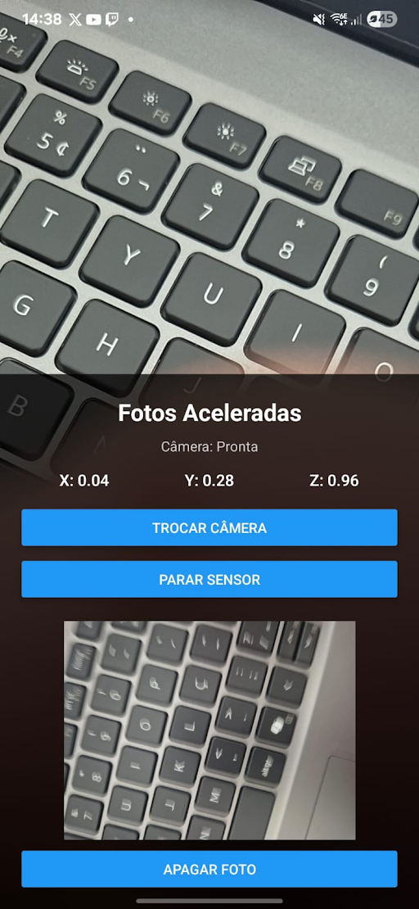

📸 Fotos Aceleradas

Aplicativo mobile desenvolvido em React Native/Expo que funciona como uma espécie de “caixa-preta do celular”.

O aplicativo utiliza o acelerômetro para identificar movimentos bruscos. Quando um movimento acima do limite definido é detectado, o sistema registra automaticamente uma foto, juntamente com a data e o horário do registro.

O aplicativo também permite visualizar o histórico das fotos capturadas.

🎯 Objetivo

O objetivo do projeto é utilizar os recursos de hardware do celular para criar um sistema capaz de detectar movimentos bruscos e registrar automaticamente uma evidência visual do momento.

O funcionamento é baseado no seguinte fluxo:

Movimento brusco
       ↓
Acelerômetro detecta
       ↓
Sistema identifica o impacto
       ↓
Câmera é acionada
       ↓
Foto é registrada
       ↓
Data e horário são armazenados
       ↓
Registro aparece no histórico
📱 Funcionalidades
📳 Monitoramento do acelerômetro do celular;
⚡ Detecção de movimentos bruscos;
📷 Captura automática de uma foto quando o movimento é detectado;
🕐 Registro da data e horário da captura;
📚 Histórico das fotos registradas;
🗑️ Exclusão de fotos do histórico;
🔄 Possibilidade de trocar entre a câmera frontal e traseira;
▶️ Controle para iniciar e parar o sensor;
📊 Exibição dos valores atuais dos eixos X, Y e Z do acelerômetro.

Observação: o projeto não utiliza localização/GPS. O registro é composto pela foto + data e horário do evento.

🖼️ Interface

A tela principal apresenta:

Status da câmera;
Valores dos eixos X, Y e Z do acelerômetro;
Botão para trocar a câmera;
Botão para iniciar/parar o sensor;
Foto registrada;
Botão para apagar a foto.

Exemplo da aplicação:

📁 Estrutura do projeto

A estrutura utilizada no projeto é:

fotos_aceleradas/
│
├── .claude/
│
├── assets/
│
├── .gitignore
├── AGENTS.md
├── App.js
├── app.json
├── CLAUDE.md
├── fotos_aceleradas.js
├── index.js
├── package-lock.json
├── package.json
└── PROJETO.md
📂 Descrição dos arquivos
Arquivo/Pasta	Função
.claude/	Arquivos relacionados às configurações utilizadas pelo ambiente Claude
assets/	Recursos estáticos utilizados no projeto
.gitignore	Define arquivos que não devem ser enviados ao Git
AGENTS.md	Instruções e informações para agentes utilizados no desenvolvimento
App.js	Componente principal da aplicação
app.json	Configurações do aplicativo Expo
CLAUDE.md	Informações e instruções relacionadas ao desenvolvimento com Claude
fotos_aceleradas.js	Implementação principal da funcionalidade do projeto
index.js	Ponto de entrada da aplicação
package-lock.json	Registra as versões exatas das dependências instaladas
package.json	Contém informações do projeto, scripts e dependências
PROJETO.md	Documentação complementar do projeto
⚙️ Tecnologias utilizadas
React Native — desenvolvimento da aplicação mobile;
Expo — execução e gerenciamento do projeto;
JavaScript — linguagem utilizada no desenvolvimento;
Acelerômetro — identificação dos movimentos do dispositivo;
Câmera do celular — captura das fotos;
Expo Sensors — acesso aos sensores do dispositivo;
Expo Camera — acesso à câmera do celular.
📳 Funcionamento do acelerômetro

O acelerômetro fornece valores referentes aos três eixos do movimento:

X — movimento horizontal;
Y — movimento vertical;
Z — movimento de profundidade.

O aplicativo monitora esses valores continuamente enquanto o sensor está ativo.

Quando os valores indicam um movimento considerado brusco, o aplicativo executa a captura da foto automaticamente.

Exemplo:

X: 0.04
Y: 0.28
Z: 0.96

Esses valores são atualizados conforme o celular se movimenta.

📸 Registro da foto

Quando um movimento brusco é detectado:

O acelerômetro identifica a alteração no movimento;
O aplicativo verifica se o movimento ultrapassou o limite definido;
A câmera é acionada;
Uma foto é capturada;
A foto é apresentada na tela;
O registro fica disponível para consulta no histórico.

Cada registro contém:

Foto
Data
Horário
🗂️ Histórico

O histórico permite visualizar os registros realizados pelo aplicativo.

A ideia é possibilitar que o usuário consulte posteriormente as fotos que foram capturadas automaticamente durante os movimentos bruscos.

Exemplo:

HISTÓRICO DE REGISTROS

📷 Foto
📅 13/08/2026
🕐 14:38

📷 Foto
📅 13/08/2026
🕐 14:42

📷 Foto
📅 13/08/2026
🕐 14:47

Também é possível excluir um registro através do botão de exclusão disponibilizado na interface.

▶️ Como executar o projeto
1. Instalar as dependências

Abra o terminal na pasta do projeto:

npm install
2. Iniciar o Expo

Execute:

npx expo start
3. Executar no celular

Com o aplicativo Expo Go instalado no celular, escaneie o QR Code apresentado pelo Expo.

Como o projeto utiliza recursos físicos do dispositivo, como acelerômetro e câmera, recomenda-se executar a aplicação em um celular físico.

🧪 Testando o sistema

Para testar a aplicação:

Abra o aplicativo;
Permita o acesso à câmera quando solicitado;
Inicie o sensor;
Observe os valores X, Y e Z;
Faça um movimento brusco com o celular;
Aguarde a detecção;
Verifique se uma foto foi registrada;
Confira o registro no histórico;
Teste a opção de trocar a câmera;
Teste a exclusão da foto.
🚀 Resultado esperado

Ao final, o aplicativo deve funcionar como uma pequena caixa-preta fotográfica, monitorando continuamente o movimento do celular e registrando automaticamente uma foto quando um movimento brusco é identificado.

O usuário consegue controlar o sensor, visualizar os valores do acelerômetro, trocar a câmera, consultar os registros e excluir fotos.

👨‍💻 Projeto

Nome: Fotos Aceleradas

Tecnologia principal: React Native + Expo

Finalidade: Utilização de sensores e câmera do smartphone para detecção de movimentos bruscos e registro automático de imagens.